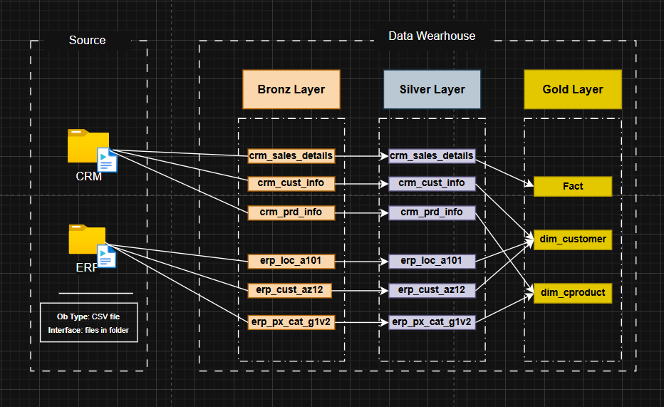

# Data Warehouse and Analytics Project

Welcome to the **Data Warehouse and Analytics Project** repository! 🚀  
This project showcases a modern data warehouse built using SQL Server, covering the full pipeline from raw data ingestion to analytics and insights.

Designed as a portfolio project, it demonstrates real-world data engineering practices and end-to-end data workflows.

---

## 👨‍💻 Author

**Tarek Mahmoud Abdelrady**  
Data Engineering Enthusiast | Azure & SQL Developer  

---
## ⭐ Data Model (Star Schema)

The Gold Layer is designed using a Star Schema to optimize analytical queries and reporting.

It consists of:
- Fact Table: sales
- Dimension Tables: customers, products, etc.

<p align="center">
  
  <br>
  <em>Figure 1: Data Warehouse Architecture (Medallion)</em>
</p>


## 🏗️ Data Architecture

This project follows the **Medallion Architecture** approach:

- **Bronze Layer**: Raw data ingestion from source systems (CSV files) into SQL Server.
- **Silver Layer**: Data cleaning, transformation, and standardization.
- **Gold Layer**: Business-ready data modeled using a **Star Schema** for analytics.
- 
<p align="center">
  
</p>

---

## 📖 Project Overview

This project includes:

1. **Data Architecture**: Designing a scalable modern data warehouse.
2. **ETL Pipelines**: Extracting, transforming, and loading data into structured layers.
3. **Data Modeling**: Creating fact and dimension tables optimized for analytics.
4. **Analytics & Reporting**: Writing SQL queries to generate insights.

🎯 This project demonstrates skills in:
- SQL Development
- Data Engineering
- ETL Pipelines
- Data Modeling (Star Schema)
- Data Analytics

---

## 🛠️ Tools & Technologies

- SQL Server
- SQL Server Management Studio (SSMS)
- CSV Files (Data Sources)
- Draw.io (for diagrams)
- Git & GitHub

---

## 🚀 Project Requirements

### 📌 Objective

Build a modern data warehouse using SQL Server to integrate and analyze data from multiple sources.

---

### ⚙️ Specifications

- **Data Sources**: ERP & CRM data (CSV files)
- **Data Cleaning**: Handle missing values, duplicates, and inconsistencies
- **Integration**: Merge data into a unified analytical model
- **Modeling**: Design a star schema for reporting
- **Analytics**: Generate insights on:
  - Customer behavior
  - Product performance
  - Sales trends

---

## 📊 Analytics Goals

This project answers key business questions such as:

- Who are the top customers?
- What are the best-selling products?
- How do sales trends change over time?
- Which regions generate the most revenue?

---

## 📂 Repository Structure
```
data-warehouse-project/
│
├── datasets/                           # Raw datasets used for the project (ERP and CRM data)
│
├── docs/                               # Project documentation and architecture details
│   ├── etl.drawio                      # Draw.io file shows all different techniquies and methods of ETL
│   ├── data_architecture.drawio        # Draw.io file shows the project's architecture
│   ├── data_catalog.md                 # Catalog of datasets, including field descriptions and metadata
│   ├── data_flow.drawio                # Draw.io file for the data flow diagram
│   ├── data_models.drawio              # Draw.io file for data models (star schema)
│   ├── naming-conventions.md           # Consistent naming guidelines for tables, columns, and files
│
├── scripts/                            # SQL scripts for ETL and transformations
│   ├── bronze/                         # Scripts for extracting and loading raw data
│   ├── silver/                         # Scripts for cleaning and transforming data
│   ├── gold/                           # Scripts for creating analytical models
│
├── tests/                              # Test scripts and quality files
│
├── README.md                           # Project overview and instructions
├── LICENSE                             # License information for the repository
├── .gitignore                          # Files and directories to be ignored by Git
└── requirements.txt                    # Dependencies and requirements for the project
```
---


## 🛡️ License

This project is licensed under the [MIT License](LICENSE). You are free to use, modify, and share this project with proper attribution.


---

## 🧠 Key Concepts Applied

- Medallion Architecture (Bronze / Silver / Gold)
- ETL Pipeline Design
- Data Cleaning & Transformation
- Star Schema Modeling
- Analytical SQL Queries

---

## 🛡️ License

This project is licensed under the **MIT License**.  
Feel free to use, modify, and share with proper attribution.

---

## 🌟 About Me

Hi! I'm **Tarek M Radi**, a Cloud Data Engineering student passionate about building data systems and transforming raw data into meaningful insights.

Currently focusing on:
- Data Engineering with Azure
- SQL & Data Warehousing
- Building real-world portfolio projects

---

## 📬 Connect With Me

- LinkedIn: *(www.linkedin.com/in/tarek-mahmoud-abdelrady-404884354)*
- GitHub: *([your GitHub profile](https://github.com/Tarek-Radi))*
- Email: *(noortarak2004@gmail.com)*

---
